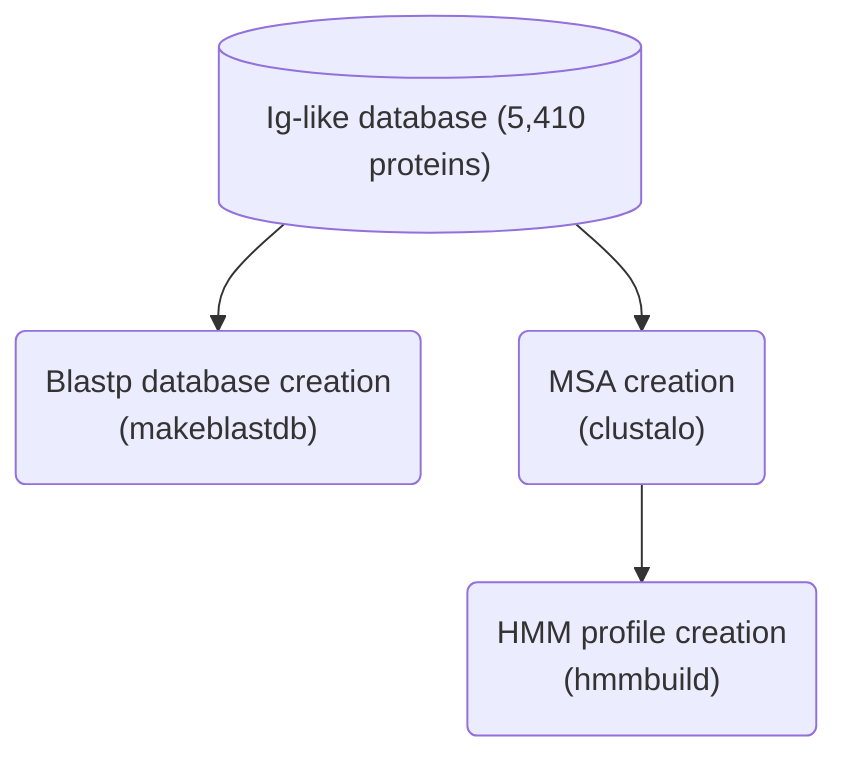
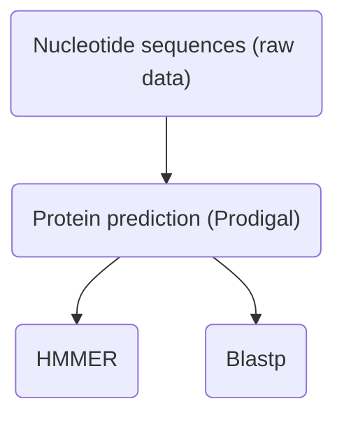
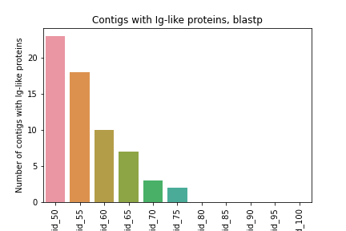
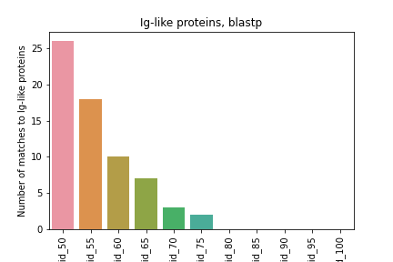

## Search for Ig-like domains in bacteriophages

The raw bacteriophage data included <a href="./00_data/Fagoma_Raton_5498.fasta">5,498 contigs</a>.

Database download from the UniProt with the term 'Ig-like', considering only the <a href="./01_databases/uniprotkb_ig_like_AND_reviewed_true_2023_09_30.fasta">validated proteins</a> (https://www.uniprot.org/uniprotkb?query=reviewed%3Atrue+ig-like).

`src` folder contains all the scripts necessary to replicate this analysis.

### Pipelines

#### Databases creation

#### Sequence search and alignment with blastp and hmmer

#### Results

<a href="./src/blastp.sh">Script</a> used for blastp search. The parameters considered included an e-value of 1e-3, and several identity and coverage cutoffs.

Contigs with Ig-like proteins predicted with blastp:

Proteins with homology to Ig-like proteins:

